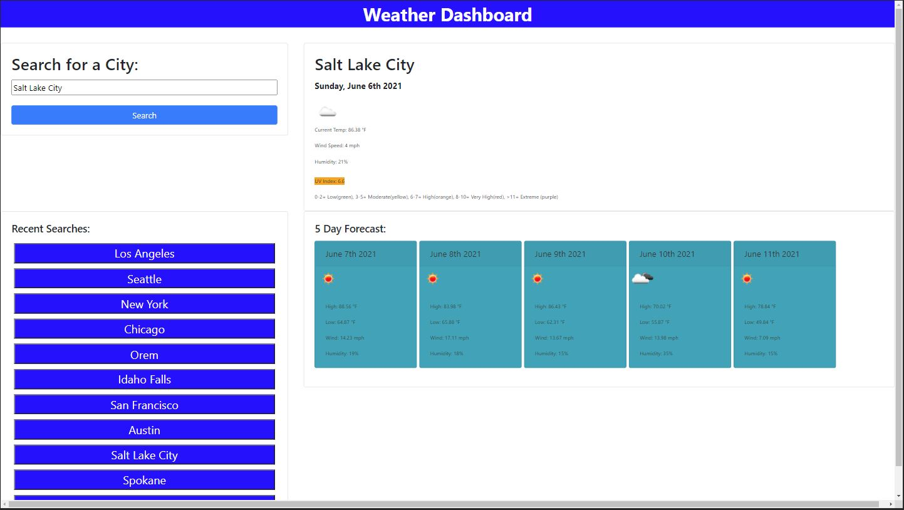

# Weather-display

## Display the current weather for a selected city and it's 5 day forecast
---
### **General Info:**
As for API calls, I actually used 2 different API calls from the OPENWEATHER API. I used "one call" and I also used the "5 day" call. I did this so that I could pull the latitude and longitude from the '5 day' call in order to fulfil the API call requirements for the 'one' call. Once the data loads, the city name is pushed to an empty array. Then a for loop iterates through that array and creates buttons with the city name. I tried a few things but I coulnd't get the page to reload with the saved city info.

### **Requirements**
AS A traveler
I WANT to see the weather outlook for multiple cities
SO THAT I can plan a trip accordingly

GIVEN a weather dashboard with form inputs
WHEN I search for a city
THEN I am presented with current and future conditions for that city and that city is added to the search history
WHEN I view current weather conditions for that city
THEN I am presented with the city name, the date, an icon representation of weather conditions, the temperature, the humidity, the wind speed, and the UV index
WHEN I view the UV index
THEN I am presented with a color that indicates whether the conditions are favorable, moderate, or severe
WHEN I view future weather conditions for that city
THEN I am presented with a 5-day forecast that displays the date, an icon representation of weather conditions, the temperature, the wind speed, and the humidity
WHEN I click on a city in the search history
THEN I am again presented with current and future conditions for that city

### **Final Notes**
With the help of my tutor and the TA's I was able to complete most of this assignement. I was able to code through about 90% of it on my own before I needed help. That felt great that I was able to finally feel like I knew what needed to happen and was able to piece it together from the ground up. There was 1 thing that I couldn't get to work and that was the past search recall to function properly. I got the data to display but I couldn't figure out how to load that info again to display.  

### **Location:**
Website can be found at : https://mattbisbee.github.io/Weather-display/

GitHub: https://github.com/mattbisbee/Weather-display/

## **Images:**

